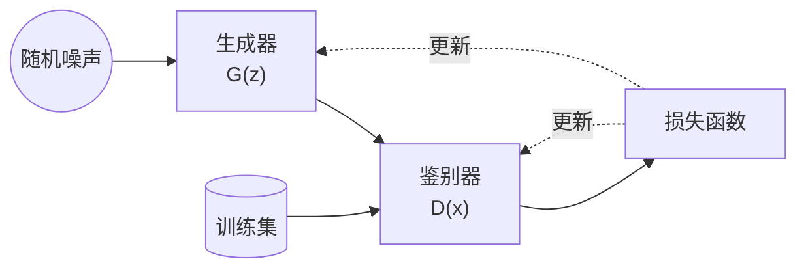

# 信竞生的生成式对抗神经网络

这是我学习生成式对抗神经网络 (Generative Adversarial Network, GAN) 的笔记。

<!-- more -->

## 什么是 GAN

GAN 是由 Ian J. Goodfellow 等人在 2014 年提出的[一种生成式模型的**框架**](https://arxiv.org/abs/1406.2661)。GAN 可以形象理解为让一个试图生成假的数据、蒙混过关的生成器 (generator) 和一个“火眼金睛”的鉴别器 (discriminator) 相互对抗，互相进步。具体的细节在这里不多加介绍，可以参考 [Pytorch 官网的 GAN 教程](https://pytorch.org/tutorials/beginner/dcgan_faces_tutorial.html)

一个很违反常识的问题是，为什么两个空白的生成器、鉴别器经过某种训练过程后最终居然可以完成我们想要的任务呢？比如生成复杂的人脸，图像超分辨率等。这其实就是神经网络算法的奥妙所在——当网络复杂到一定程度时，局部最优解会变得泛滥，我们只要从任何一点出发不断进行梯度下降 (gradient descent) 的过程就可以得到一个不错的局部最优解。很令人惊奇的是，把两个这样的网络套在一起，训练的过程还是这个样子的。

## Pytorch 与普通的神经网络

使用 Pytorch 书写神经网络并不是很困难的事情，因为它为我们提供了方便的 `torch.nn.Sequential()` 容器。