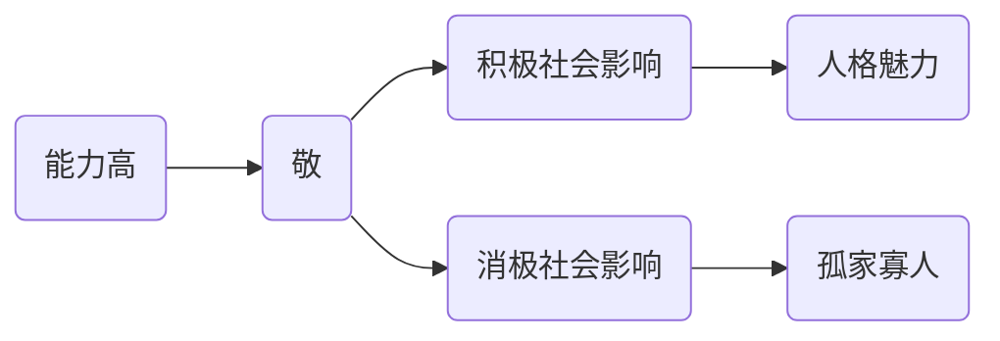

# 选课记

这篇文章主要记录我大一秋季学期的选课经历，和期间听到的一次心理健康演讲。

<!-- more -->

## 日程安排

1. 2024/8/30：一年级课程预选开始（12:00）
2. 2024/9/3：
	1. 一年级课程抽签（8:00-18:00）
	2. 正选与退课开始（18:00）
3. 2024/9/4：一年级课程面向全校开放选课和个性化选课（12:00）
4. 2024/9/14：正选与退课截止（18:00）

## 选课日志

Update on 2024/9/3：之前一直没有写，现在才想起来写这段文字。

除了大学生心理学（四进一的通过率，可能要等到春季学期才能修了），其他抽签的课都抽中了。虽然选中的老师不是最优秀的，但应该还是相当不错的。可能算是我比较幸运，也可能是我比较保守的选课方案的缘故。

主要考虑的是 L4 级别的科普英语交流A，这门课只有在周五才能保证抽中（可能因为不少受欢迎的数学分析和力学课都和这节课冲突），其他所有的选课方案都是基于它展开的。因为选了这门课，数学分析和力学抽签的竞争激烈程度都小一些。

唯一的不足可能就是一周五节早八，但是对于我这种作息较为正常的人来说应该还好。由于心理学没有中签，这个学期的学业压力就会轻松一些，可以更加集中精力学好我的数学分析B1，力学A，和化学原理A（这三门课似乎都不会很简单）。

Update on 2024/9/4：被人工智能科技英才班录取。化学原理 A 不会上了，力学 A（估计）也不会上了，应该会多一门线性代数 B1。这个学期好好学数学。
## 关于西区三教和东区五教

实验时间：2024/8/31 上午

| 实验  | 起点   | 终点   | 方式         | 时间（精确到半分钟） | 备注   |
| --- | ---- | ---- | ---------- | ---------- | ---- |
| 1   | 宿舍楼  | 西区三教 | 骑行         | 4.5        |      |
| 2   | 西区三教 | 东区五教 | 步行（120次每分） | 18.0       | 见备注一 |
| 3   | 东区五教 | 西区三教 | 骑行         | 8.5        |      |
| 4   | 西区三教 | 东区五教 | 步行（120次每分） | 17.5       | 见备注二 |
| 5   | 东区五教 | 宿舍楼  | 骑行         | 4.5        |      |

- 备注一：该实验较不严谨，由于绕了远路，实验结果通过加减法运算纠正。走路时等了红绿灯，进中校区时掏校园卡花费了时间。
- 备注二：汲取上次教训，走路使用了节拍器，没有等红绿灯，进中校区提前准备好了校园卡。
- 步幅没有测量，可以之后补测。

## 心理健康演讲

Update on 2024/9/5：

演讲人：安徽大学高志强

“第十名现象”：在教学中下个阶段最有可能成功的学生，很多时候不是学习成绩最好的学生，而是班级排名在第十名左右的学生。

产生的原因：心理定势与人格固执，我们习惯性的在经验库中寻找**过去成功的经验**解决问题，而对新的**创造性**的方法没有思考。**心理定势**是指重复先前的心理操作所引起的对活动的准备状态。心理定势能够易化大多数的问题解决，但也会导致方法固着。

智力（智商）的更高境界——智慧（物竞天择，适者生存，适应是更大的智慧）

> 韩非子日：“世异则事异，事异则备变。……是以圣人不期修古，不法常可，论世之事，因为之备。——《韩非子·五蠹》

社会角色转化有以下几个概念：

- **角色期待**：不符合期待——收到**文化**反噬（不只是“社会性死亡”）
	角色期待分为**个人角色期待**和**组织角色期待**
- **角色认知**：对对方角色期待的认知
- **角色转化**：使自己更符合角色认知的过程
	主动角色转化：预先进行考察的角色转化
	被动角色转化：意识到出现问题，再采取行动的角色转化
	蒙昧角色转化：不到没有办法，不采取行动的角色转化
	
    > 生而知之者，上也；学而知之者，次也；困而学之，又其次也；困而不学，民斯为下矣。——《论语》
    
- **角色实践**：角色转化的结果
	角色冲突、角色成功、角色失败、角色逃避

生涯设计的关键在于“生涯设计”

习得性无助：习得性无助能够在场景间迁移。

“内卷”，“躺平”：

- 内卷的**客观原因**在于资源的稀缺性和价值评价单一（唯独与标准）
- 内卷的直接原因：横向社会比较下的焦虑
- 内卷子承父业

情绪脑：当情绪被高度激活，理性会被无限压缩——情绪管控能力是自我力量的标识

| 情商  | 自我                                  | 他人                             |
| --- | ----------------------------------- | ------------------------------ |
| 辨识  | 自我觉察： 情绪的自我觉察 正确的自我评估 自信   | 社会觉察： 同理心 换位思考 情绪辨识   |
| 调节  | 自我管理： 情绪的自我控制 适应力、主动性 阳光心态 | 关系管理： 情绪感染力 沟通能力 合作能力 |

社会影响——实质社会影响，心理社会影响（核心为情绪感染）

“遇见你，我活成了我喜欢的样子”——积极社会影响

让·皮亚杰——自我中心学说——“水至清则无鱼，人至察则无徒”，换位思考是人生的必修课

> 子绝四：毋意，毋必，毋固，毋我。——《论语》

### 一点想法

上述心理演讲是建立在“我们需要符合众人对我们的预期”这个前提上进行的。但是，现实生活中的我们并不能随波逐流。在千帆竞渡的世界中，我们应该秉有属于自己的坚持。

> 易初本迪兮，君子所鄙。——《九章·怀沙》

比如，我们不需要向着对所有人的角色认知进行转化。我们并不需要迎合世界上所有的人，而是**身边的人**和**可能对自己有帮助的人**。但是，“有帮助”的标准就是仁者见仁，智者见智的事情了。

这点浅薄的观点启发自一位好友。